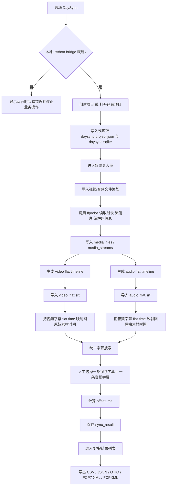
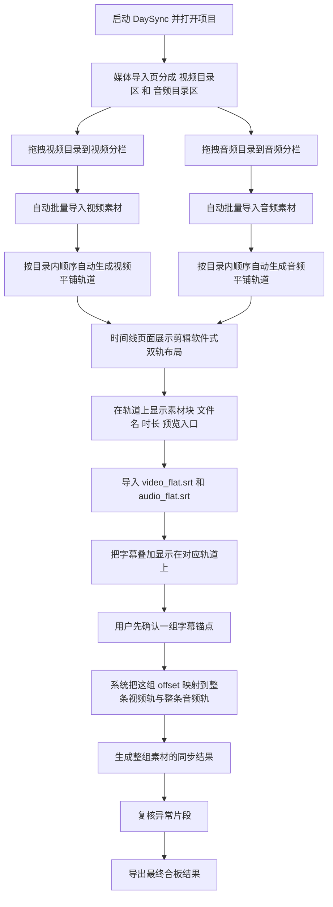

# DaySync 合板流程图

- 文档时间：2026-05-18
- 适用范围：当前 `DaySync` 桌面版已实现流程 + 按 `需求` 规划的下一阶段目标流程
- 用途：给你快速审阅“现在软件怎么走”“下一步应该改成什么样”，方便直接指出要调整的节点

## 1. 当前已实现的合板主流程

这张图只画 **现在已经可以在软件里实际走通** 的链路，不把未落地功能混进去。

## 2. 当前流程的真实特点

这部分不是目标设想，而是当前程序的真实行为。

- 当前导入流程还是“把素材导入项目”，还没有完全变成你想要的“视频目录一条轨、音频目录一条轨”的剪辑式入口。
- 当前 flat timeline 的核心作用是：把多个素材平铺成一条连续时间线，方便后续字幕回写、搜索和 offset 计算。
- 当前对齐主链仍以“字幕锚点”为核心，也就是先搜索字幕，再手动选锚点，再生成同步结果。
- 当前导出已经不止 CSV，还留了 JSON、OTIO、FCP 7 XML、FCPXML 几条导出链，但 UI 主目标仍然是合板结果确认。

## 3. 按你需求希望演进到的目标流程

这张图对应你在 `需求` 里描述的下一阶段方向，也就是更接近剪辑软件思维的“目录级导入 + 自动生成轨道 + 轨道上对齐字幕”的流程。

## 4. 你最值得确认的 6 个调整点

- `导入入口`：是否确定以后只强调“目录导入”，弱化单文件逐个选择？
- `自动建轨`：导入目录后，是否默认立刻生成视频轨和音频轨，不再让用户手动勾选素材建 timeline？
- `排序规则`：目录内素材是按文件名排序，还是按拍摄时间/创建时间排序更符合你的实际工作流？
- `字幕对齐方式`：是否确定“一组字幕锚点确认后，整条轨道共用一个 offset” 是主要模式？
- `时间线视觉`：是否需要把当前偏数据表式页面，明确升级为“素材块 + 轨道 + 字幕条 + 预览窗”的剪辑软件式布局？
- `复核颗粒度`：后续复核是按“整条轨道”看，还是按“异常素材块/异常字幕段”看更适合你？

## 5. 我建议的下一步

如果你认同这份流程图，下一轮最稳的开发顺序建议是：

1. 先改媒体导入页：视频/音频分栏、支持目录拖拽、列表可滚动。
2. 再改时间线生成逻辑：导入目录后自动生成视频轨和音频轨。
3. 再改时间线页面：从文本列表切换成剪辑软件式轨道布局。
4. 最后把字幕叠加、文件名叠加、轨道预览串起来。
