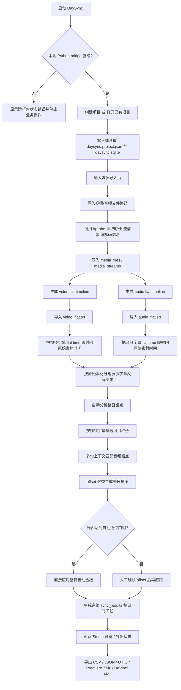
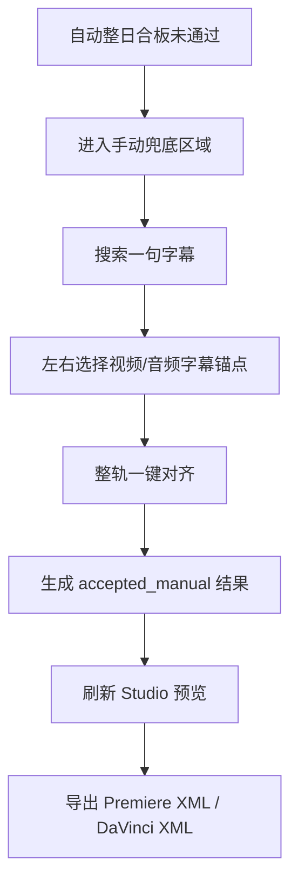

# DaySync 合板流程图

- 文档时间：2026-05-18
- 适用范围：当前 `DaySync` 桌面版已实现流程 + 按 `需求` 规划的下一阶段目标流程
- 用途：给你快速审阅“现在软件怎么走”“下一步应该改成什么样”，方便直接指出要调整的节点

## 1. 当前已实现的自动整日合板主流程

这张图只画 **现在已经可以在软件里实际走通** 的主链，不把未来增强功能混进去。

## 2. 当前流程的真实特点

这部分不是目标设想，而是当前程序的真实行为。

- 当前 flat timeline 仍然是整日主时间线骨架，视频轨为主，音频轨只负责对齐与裁切引用。
- 当前整日字幕已经会反解回原始素材级视图，并在工作台里显示素材分组、warning/failed、可用种子数量。
- 当前主链已经从“手动先搜一组锚点”升级为“先自动分析整日锚点，再决定自动应用还是人工确认”。
- 当前导出主交付已经明确成两条：
  - Premiere：FCP 7 XML
  - DaVinci：FCPXML
- JSON / OTIO 保留为诊断导出，不是主要交付格式。

## 3. 手动兜底支线

当自动整日合板提案不稳定时，当前仍然保留手动字幕锚点支线。

## 4. 你最值得确认的 6 个调整点

- `导入入口`：后续是否要继续把媒体导入页推进成“视频目录 / 音频目录”双分栏主入口？
- `自动种子规则`：当前默认“每个视频素材最多取 2 条、优先长文本、排除短句和高重复句”，你是否要调整？
- `自动通过门槛`：当前仍按 `min_anchor_count=3 / tolerance=500ms / min_inlier_ratio=0.6`，是否要更严或更松？
- `低置信处理`：当前低置信不会直接落库，而是先停在 preview 等人工确认，这个策略是否保持？
- `时间线视觉`：当前已经有工作台和轨道预览，但是否继续升级成更接近 Premiere / Resolve 的素材块视觉？
- `导出交付`：当前 PR 走 Premiere XML，DaVinci 走 DaVinci XML，这个交付映射是否固定？

## 5. 我建议的下一步

如果你认可当前这条自动主链，下一轮最值得继续增强的是：

1. 把媒体导入入口继续推进成“视频目录 / 音频目录”双分栏。
2. 让导入目录后自动建轨，不再依赖手动创建 flat timeline。
3. 把自动合板 preview 做得更像“候选审查面板”，让排除原因和聚类质量更直观。
4. 继续强化时间线视觉，使其更接近剪辑软件的轨道编辑体验。
